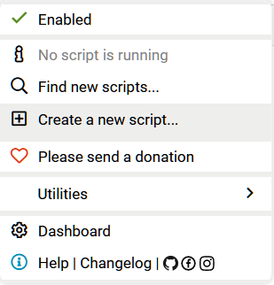

# [HKU Moodle Course Hider](./HKUMoodleCourseHider.js)
[HKU Moodle Course Hider](./HKUMoodleCourseHider.js) is a tampermonkey script that generates a menu to allow the user to select courses to be hidden or displayed on the My Courses page on HKU Moodle.

## How to use
1. Install [Tampermonkey](https://www.tampermonkey.net/) addon on your browser. 
2. Select "Create a new script..." in Tampermonkey's dropdown menu.

3. Copy and paste the content of [HKUMoodleCourseHider.js](./HKUMoodleCourseHider.js) into the editor and save it by pressing Ctrl+S or clicking "File"->"Save" in the editor.

4. The script should now be ready to run on [moodle.hku.hk](https://moodle.hku.hk).
